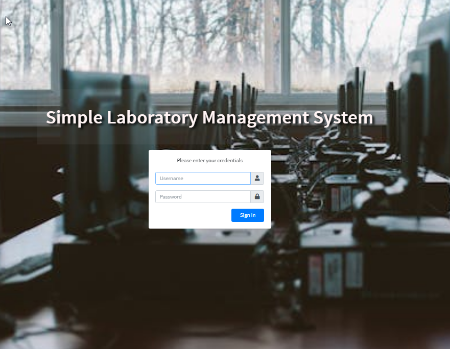
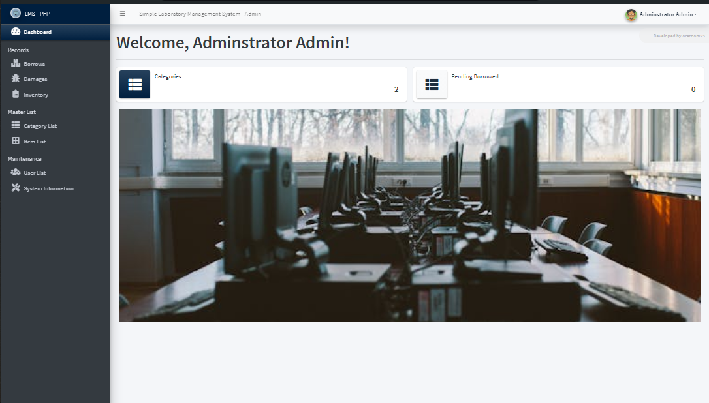
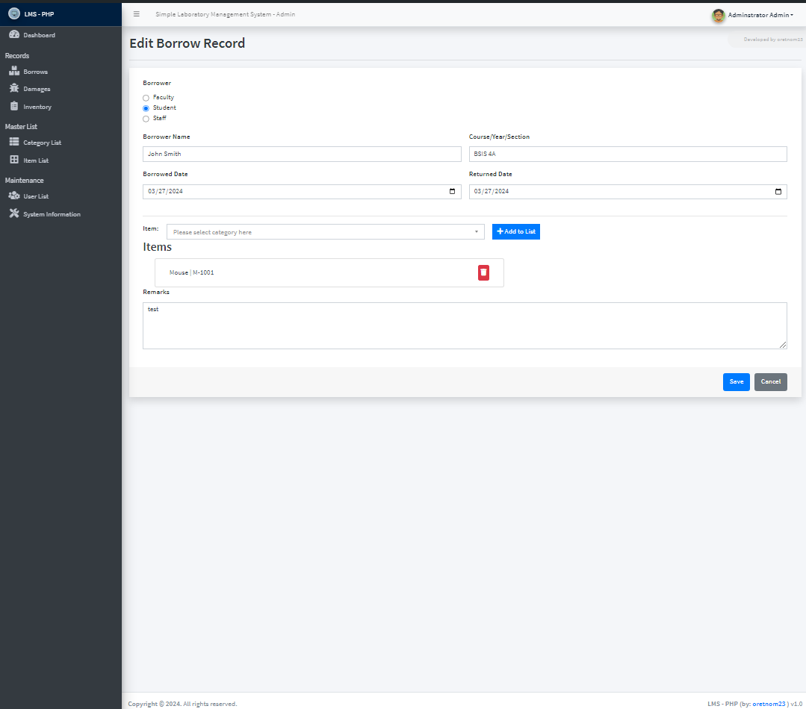
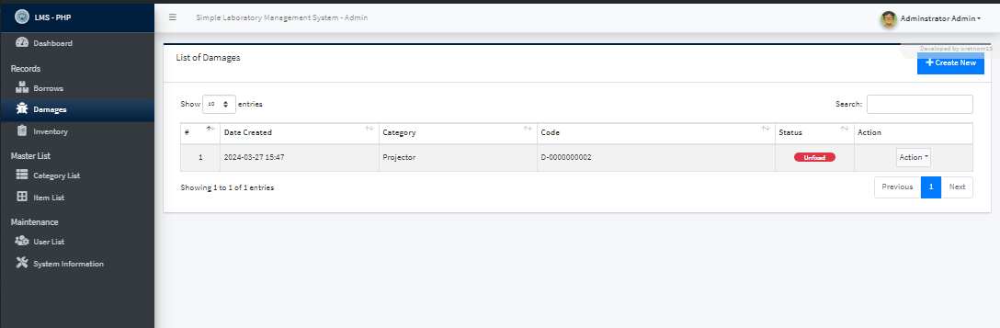
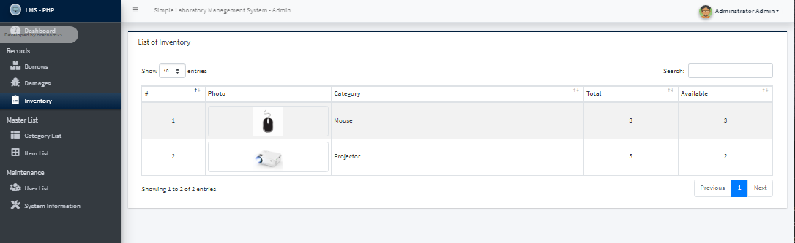

# LabMate
LabMate – Your smart companion for lab management. It is a smart and efficient Laboratory Management System designed to streamline lab operations. From tracking equipment usage to managing user access and scheduling, LabMate ensures seamless organization and productivity in any laboratory environment.

This is a Comprehensive  Laboratory Management System. It's a web app created using PHP and MySQL Database. The main purpose of this app is to make it easy to handle borrowing and keep track of information in the school/college labs. It's designed with a friendly user interface and lots of features that anyone can use. Only staff registered with the school's computer lab can use this system. It lets users list and store various supplies in the lab. You can also record when supplies are borrowed. Plus, there's an inventory feature to keep track of total supplies and availability.

### Features and Functionalities
Here are the following features and functionalities of this LabMate:

    • Login Page
    • Dashboard Page
    • Total Supply Category
    • Total Pending Borrowed Items
    • Category Management = [Add New Category, List All Categories, Edit Category Details, View Category Details, Delete Category Details]
    • Item Management = [Add New Item, List All Items, Edit Item Details, View Item Details, Delete Item Details]
    • Borrows Management = [Add New Borrowed Item Record, List All Borrowed Items Record, Edit Borrowed Items Record, View Borrowed Items Record, Delete Borrowed Items Record]
    • Damage Management = [Add New Damaged Item Record, List All Damaged Item Record, Edit Damaged Item Record, View Damaged Item Record, Delete Damaged Item Record]
    • Items Invetory
    • User Management = [Add New User, List All Users, Edit User, Delete User]
    • Update System Information
    • Update Account Information

### Technologies
Here are the following technologies that I used to develop this LabMate:

    • PHP
    • MySQL Database
    • HTML
    • CSS
    • JavaScript
    • jQuery
    • DataTables
    • Bootstrap Framework
    • AdminLTE Template
    • Select2 Library
    • FontAwesome Icons

### Snapshots

### How to Run?
Requirements

    • Download and Install any local web server such as XAMPP.
    • Download the provided source code zip file.

##### System Installation/Setup

    1. Enable the GD Library in your php.ini file.
    2. Open your XAMPP Control Panel and start Apache and MySQL.
    3. Extract the downloaded source code zip file.
    4. Copy the extracted source code folder and paste it into the XAMPP's "htdocs" directory.
    5. Browse the PHPMyAdmin in a browser. i.e. http://localhost/phpmyadmin
    6. Create a new database named lms_db.
    7. Import the provided SQL file. The file is known as lms_db.sql located inside the database folder.
    8. Browse the AC Repair and Services System in a browser. i.e. http://localhost/php-lms/.

##### Default Admin Access
Username: admin
Password: admin123